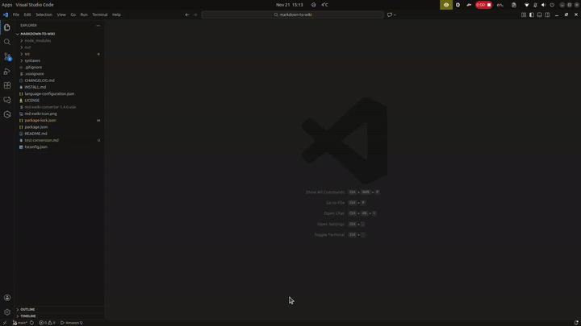

# Markdown to XWiki Converter

A VS Code extension that converts Markdown files to XWiki format with live preview capabilities.



## Features

- **Bidirectional Conversion**: Convert between Markdown and XWiki formats
- **Live Preview**: Real-time XWiki preview with clean, readable styling
- **Syntax Highlighting**: Complete XWiki language support with syntax highlighting
- **Context Menu Integration**: Right-click conversion from file explorer
- **Enhanced XWiki Support**: Advanced formatting, macros, colored text, and more
- **Auto-completion**: Smart bracket matching and auto-closing pairs for XWiki syntax

## Usage

### Converting Files

1. **Markdown to XWiki**: Right-click any `.md` file → "Convert to XWiki"
2. **XWiki to Markdown**: Right-click any `.xwiki` file → "Convert to Markdown"

### Live Preview

1. Open any `.xwiki` file
2. Click the preview icon in the editor title bar
3. View rendered XWiki content in a side panel
4. **Live updates**: Preview automatically refreshes as you type!
5. **Scroll sync**: Preview scrolls to match your editor position

## Supported Conversions

| Element | Markdown | XWiki |
|---------|----------|-------|
| Headers | `# Header` | `= Header =` |
| Bold | `**text**` | `**text**` |
| Italic | `*text*` | `//text//` |
| Strikethrough | N/A | `--text--` |
| Underline | N/A | `__text__` |
| Superscript | N/A | `^^text^^` |
| Subscript | N/A | `,,text,,` |
| Code | `` `code` `` | `##code##` |
| Code Block | ``` ```lang ``` | `{{code language="lang"}}{{/code}}` |
| Monospace | N/A | `{{monospace}}text{{/monospace}}` |
| Links | `[text](url)` | `[[text>>url]]` |
| Images | `` | `[[image:url]]` |
| Lists | `- item` | `* item` |
| Tables | `\| cell \|` | `\| cell \|` |
| Blockquotes | `> text` | `> text` |
| Info Box | N/A | `{{info}}text{{/info}}` |
| Warning Box | N/A | `{{warning}}text{{/warning}}` |
| Error Box | N/A | `{{error}}text{{/error}}` |
| Horizontal Rule | `---` | `----` |
| Line Break | N/A | `\\` |
| Colored Text | N/A | `(% style="color:red" %)text(%%)` |

## Installation

1. Download the latest `.vsix` file from releases
2. Open VS Code
3. Press `Ctrl+Shift+P` (or `Cmd+Shift+P` on Mac)
4. Type "Extensions: Install from VSIX"
5. Select the downloaded `.vsix` file

## Configuration

You can configure where converted files are saved:

1. Open VS Code Settings (`Ctrl+,` or `Cmd+,`)
2. Search for "Markdown to XWiki"
3. Set output folders:
   - **XWiki Output Folder**: Where .xwiki files are saved
   - **Markdown Output Folder**: Where .md files are saved
   - Leave empty to save in the same folder as the source file (default)

## Requirements

- VS Code 1.74.0 or higher

## Release Notes

See [CHANGELOG.md](CHANGELOG.md) for detailed release information.

## Contributing

1. Clone the repository
2. Run `npm install` to install dependencies
3. Run `npm run compile` to build the extension
4. Press `F5` to launch a new VS Code window with the extension loaded

## License

This project is licensed under the MIT License.